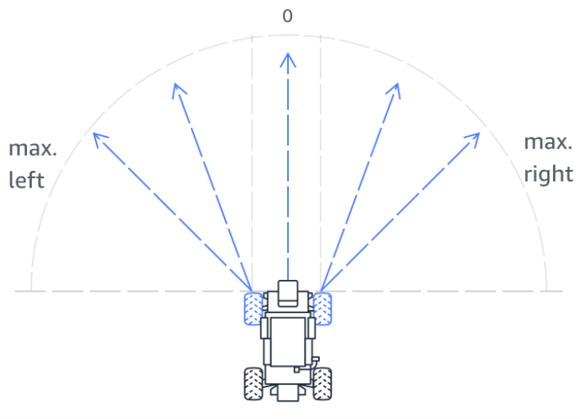
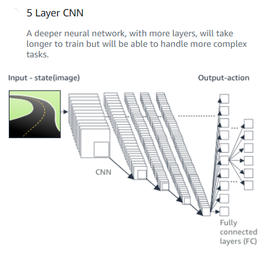

# Creating a DeepRacer Model

1. Log in to the AWS Console
	* If you don't already have, you will need to create an account

2. Search for DeepRacer and select it
	* In the AWS console, search for DeepRacer

3. Create the DeepRacer resources (only needed during the very first time you are using DeepRacer).
	* You will be promped to create the DeepRacer resources

4. Go to Garage and build your model  
	* In this section, we are going to select the configuration of the car that we will use to build our model.  

We have the option to select a car with:

* One camera
	* Classic DeepRacer configuration
* Stereo Camera
	* Advanced configuration with two cameras that provides distance information which is useful to calculate the distance from objects and thus, helps to avoid collision with vatious objects on the track, or even other DeepRacer cars that raace on the same track.
* Additionaly, we can select if the car will have LIDAR sensor or not.

LIDAR sensor | One camera | Stereo camera
-------------|------------|---------------
without LIDAR sensor |  |  
with LIDAR sensor |  |  

And then, we are going to select the action space of our car.

This means that we are going to select:

The car's maximum speed and the speed granularity
* The maximum speed can be set from 0.1 m/s to 4 m/s, in steps of 0.1 m/s
* While the speed granularity can be either 1, 2 or 3

The car's maximum steering angle and the steering granularity
* The maximum steering angle can be set from 0 degrees to 30 degress, in steps of 1 degree
* While the steering granularity can be either 3, 5 or 7

3 steering options | 5 steering options | 7 steering options
-------------------|--------------------|-------------------
 |  |  
-max 0 max | -max -(1/2)max 0 (1/2)max max | -max -(2/3)max -(1/3)max 0 (1/3)max (2/3)max max
example when max steering is set to 30 | example when max steering is set to 26 | example when max steering is set to 24
-30, 0, 30 | -26, -13, 0, 13, 26 | -24, -16, -8, 0, 8, 16, 24

Thus, the action space will have a total number of actions based on the speed granularity and the steering granularity that we have selected:

Total number of actions in the action space = speed granularity * steering granularity

From this, we conclude that the minimum number of action equals 1 * 3 = 3 actions,  
while the maximum number of actions equals 3 * 7 = 21 actions

Each action in the action space will have a unique number. In the logs, we can see that number and so we are able understand the exact acion that the our model chose at every step of a race.

**Example 1:**  

max speed: 2.6 m/s  
speed granularity: 2 

max steering angle: 30 degrees  
steering granularity: 5  

This action space consists of: 2 * 5 = 10 actions  

Action Space | speed = 1.3 m/s | speed = 2.6 m/s
-------------|-----------------|----------------
**steering = -30 degrees** | -30 degrees at 1.3 m/s | -30 degrees at 2.6 m/s
**steering = -15 degrees** | -15 degrees at 1.3 m/s | -15 degrees at 2.6 m/s
**steering =   0 degrees** |   0 degrees at 1.3 m/s |   0 degrees at 2.6 m/s
**steering =  15 degrees** |  15 degrees at 1.3 m/s |  15 degrees at 2.6 m/s
**steering =  30 degrees** |  30 degrees at 1.3 m/s |  30 degrees at 2.6 m/s

And these are the numbers that are assigned to each one of the 10 actions:  

 

**Example 2:**  

max speed: 2.4 m/s  
speed granularity: 3 

max steering angle: 25 degrees  
steering granularity: 3

This action space consists of: 3 * 3 = 9 actions

Action Space | speed = 0.8 m/s | speed = 1.6 m/s | speed = 2.4 m/s
-------------|-----------------|-----------------|-----------------
**steering = -25 degrees** | -25 degrees at 0.8 m/s | -25 degrees at 1.6 m/s | -25 degrees at 2.4 m/s
**steering =   0 degrees** |   0 degrees at 0.8 m/s |   0 degrees at 1.6 m/s |   0 degrees at 2.4 m/s
**steering =  25 degrees** |  25 degrees at 0.8 m/s |  25 degrees at 1.6 m/s |  25 degrees at 2.4 m/s

And these are the numbers that are assigned to each one of the 9 actions: 

 

**Example 3:**   

max speed: 3 m/s  
speed granularity: 1  

max steering angle: 30 degrees  
steering granularity: 7 

This action space consists of: 1 * 7 = 7 actions

Action Space | speed = 3 m/s 
-------------|---------------
**steering = -30 degrees** | -30 degrees at 3 m/s
**steering = -20 degrees** | -20 degrees at 3 m/s
**steering = -10 degrees** | -10 degrees at 3 m/s
**steering =   0 degrees** |   0 degrees at 3 m/s
**steering =  10 degrees** |  10 degrees at 3 m/s
**steering =  20 degrees** |  20 degrees at 3 m/s
**steering =  30 degrees** |  30 degrees at 3 m/s

And these are the numbers that are assigned to each one of the 9 actions: 

 

** Deep Network Settings **

After selecting the car's configuration, we need to select the network configuration which will be used to train our model.

We have the option to select either a 3-layer deep network or a 5-layer deep network.

3-layer CNN | 5-layer CNN
------------|---------------
 |  

Network configuration
* 3-layer deep network
	* This option is suitable for time racing
* 5-layer deep network
	* This option if suitable for object avoidance and for racing with other DeepRacer cars on the same track

5. Create your first model 

After all the above have been selected, the last thing we need to do is to customize our car with the color we prefer and at this point, our car's configuration has been completed and we are now ready to train our model:

