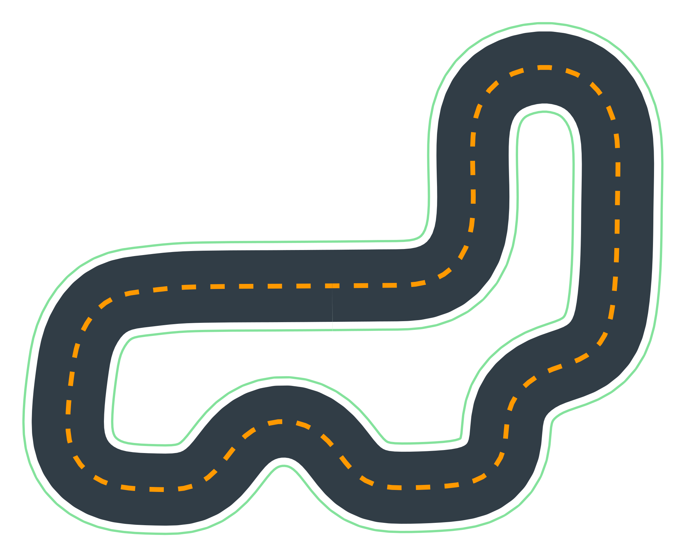
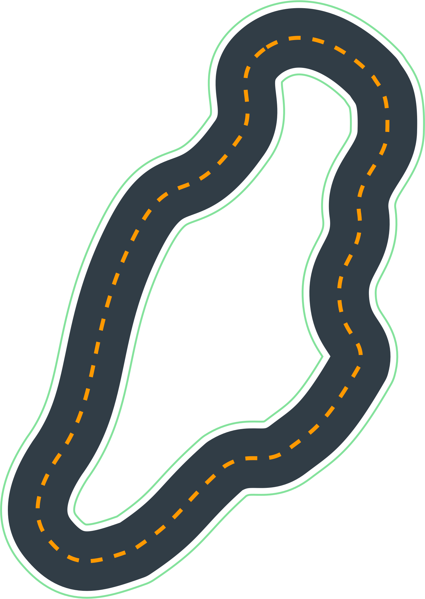
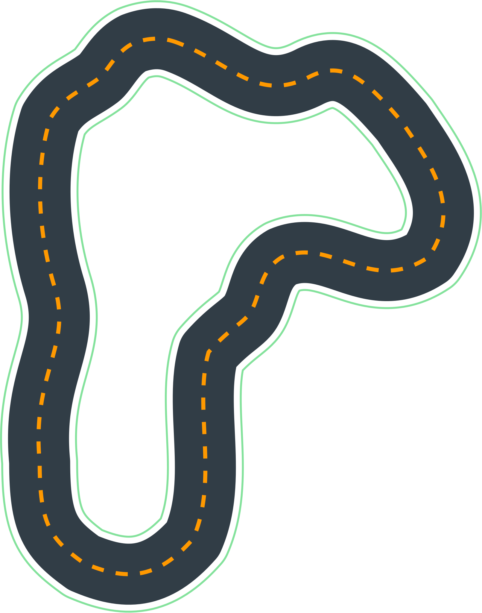
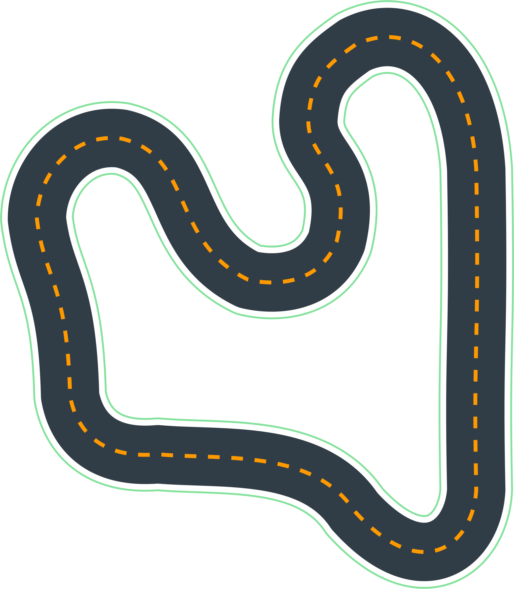
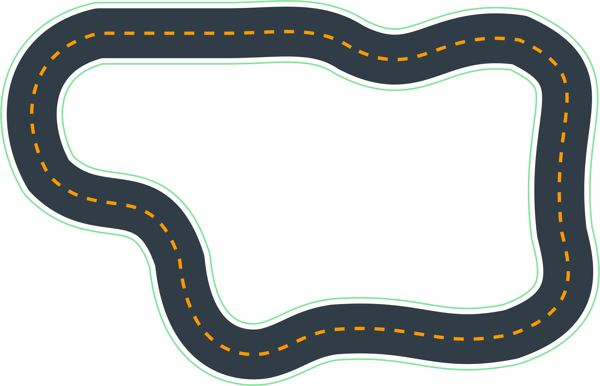
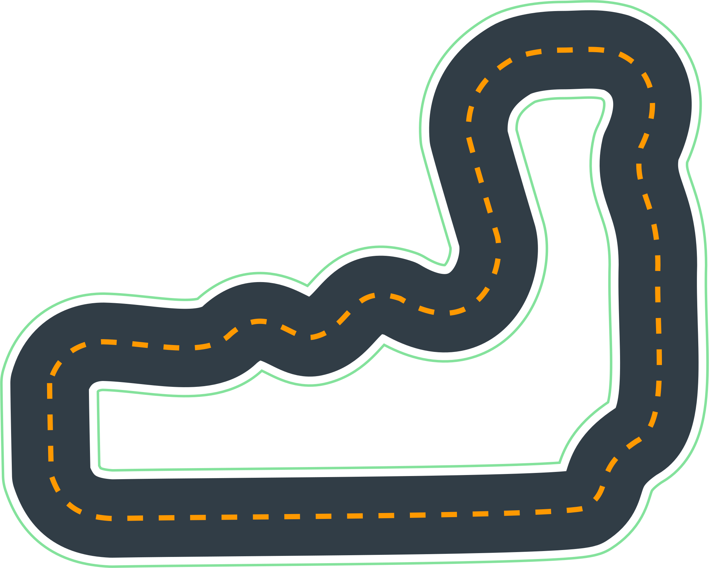
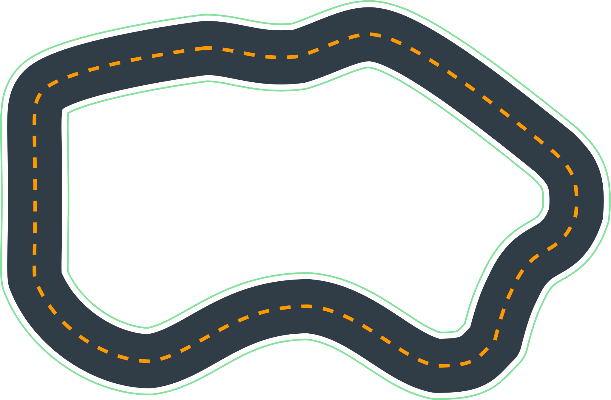
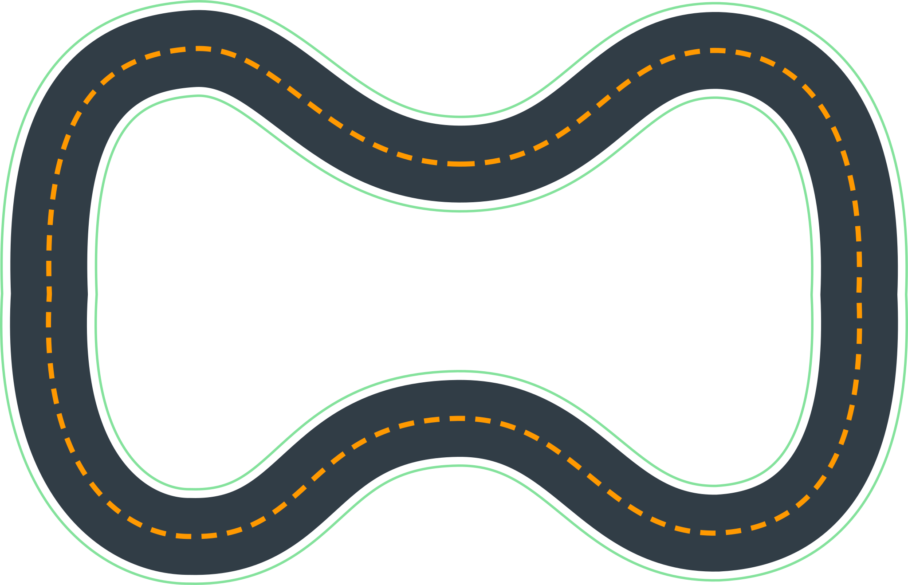
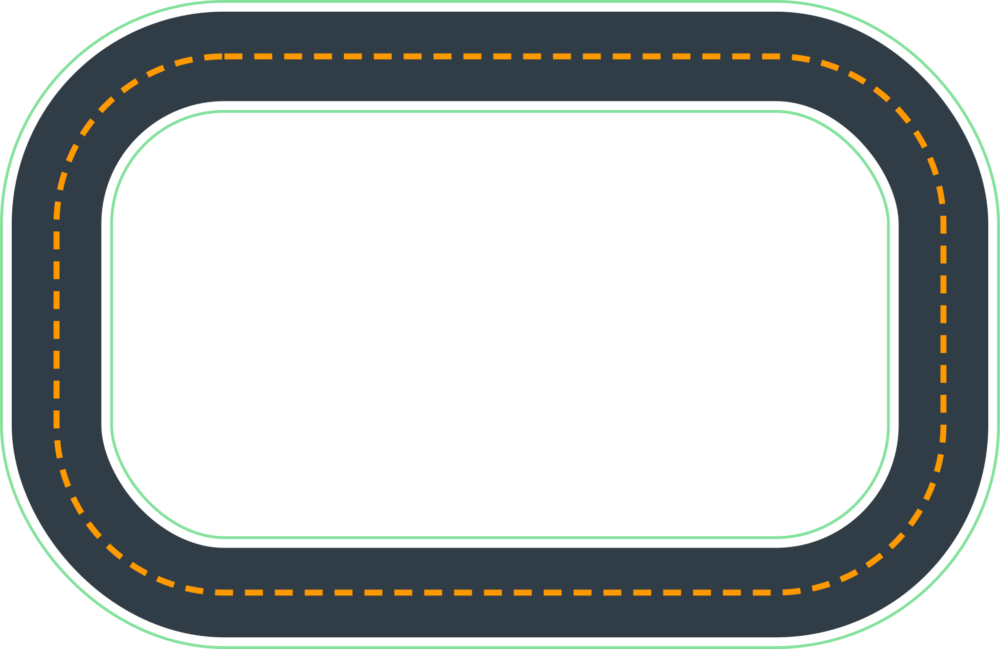
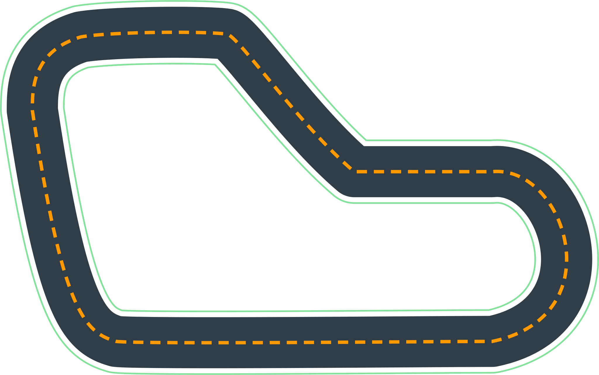

# Training Tracks:

---

# re:Invent 2018

Dimensions | meters / cm | feet / inches
-----------|--------|-------
Length: | 17.6 m | 57.97'
Width: | 76 cm | 30"

---

# AWS Summit Raceway

Dimensions | meters / cm | feet / inches
-----------|--------|-------
Length: | 22.57 m | 74'
Width: | 91 cm | 36"

---

# The 2019 DeppRacer Championship Cup

Dimensions | meters / cm | feet / inches
-----------|--------|-------
Length: | 23.12 m | 75.85'
Width: | 107 cm | 42"

---

# Toronto Turnpike Training

Dimensions | cm | inches
-----------|--------|-------
Length: | x1 | x2
Width: | y1 | y2

---

# Cumulo Carrera Training

Dimensions | cm | inches
-----------|--------|-------
Length: | x1 | x2
Width: | y1 | y2

---

# Shanghai Sudu Training

Dimensions | cm | inches
-----------|--------|-------
Length: | x1 | x2
Width: | y1 | y2

---

# Empire City Training

Dimensions | cm | inches
-----------|--------|-------
Length: | x1 | x2
Width: | y1 | y2

---

# Kumo Torakku Training

Dimensions | cm | inches
-----------|--------|-------
Length: | x1 | x2
Width: | y1 | y2

---

# London Loop Training

Dimensions | cm | inches
-----------|--------|-------
Length: | x1 | x2
Width: | y1 | y2

---

# Bowtie Track

Dimensions | cm | inches
-----------|--------|-------
Length: | x1 | x2
Width: | y1 | y2

---

# Oval Track

Dimensions | cm | inches
-----------|--------|-------
Length: | x1 | x2
Width: | y1 | y2

---

# re:Invent 2018 Wide

Dimensions | cm | inches
-----------|--------|-------
Length: | x1 | x2
Width: | y1 | y2

