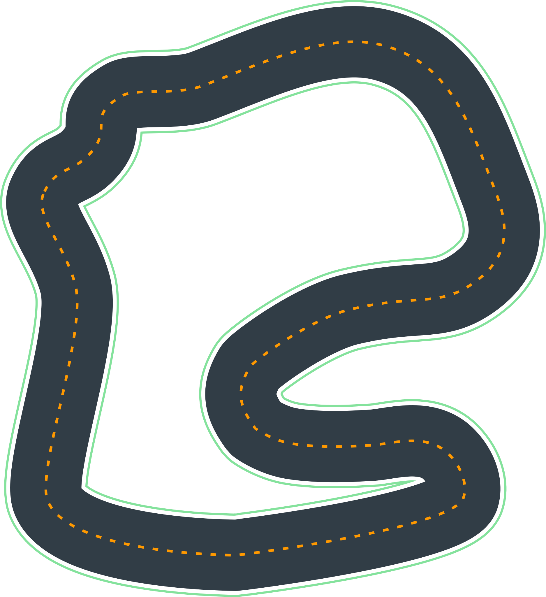

# Training Tracks:

---

# re:Invent 2018

Dimensions | meters/cm | feet/inches
-----------|--------|-------
Length: | 17.6 m | 57.97'
Width: | 76 cm | 30"

---

# AWS Summit Raceway

Dimensions | meters/cm | feet/inches
-----------|--------|-------
Length: | 22.57 m | 74'
Width: | 91 cm | 36"

---

# The 2019 DeppRacer Championship Cup

Dimensions | meters/cm | feet/inches
-----------|--------|-------
Length: | 23.12 m | 75.85'
Width: | 107 cm | 42"

---

# Toronto Turnpike Training

Dimensions | meters/cm | feet/inches
-----------|--------|-------
Length: | 23.12 m | 75.85'
Width: | 107 cm | 42"

---

# Cumulo Carrera Training

Dimensions | meters/cm | feet/inches
-----------|--------|-------
Length: | 20.51 m | 67.29'
Width: | 76 cm | 30"

---

# Shanghai Sudu Training

Dimensions | meters/cm | feet/inches
-----------|--------|-------
Length: | 22.92 m | 75.2'
Width: | 76 cm | 30"

---

# Empire City Training

Dimensions | meters/cm | feet/inches
-----------|--------|-------
Length: | 21.88 m | 71.78'
Width: | 76 cm | 30"

---

# Kumo Torakku Training

Dimensions | meters/cm | feet/inches
-----------|--------|-------
Length: | 22.63 m | 74.25'
Width: | 76 cm | 30"

---

# London Loop Training

Dimensions | meters/cm | feet/inches
-----------|--------|-------
Length: | 19.45 m | 63.81'
Width: | 76 cm | 30"

---

# Bowtie Track

Dimensions | meters/cm | feet/inches
-----------|--------|-------
Length: | 17.43 m | 57.19'
Width: | 76 cm | 30"

---

# Oval Track

Dimensions | meters/cm | feet/inches
-----------|--------|-------
Length: | 19.55 m | 64.14'
Width: | 76 cm | 30"

---

# re:Invent 2018 Wide

Dimensions | meters/cm | feet/inches
-----------|--------|-------
Length: | 16.64 m | 54.59'
Width: | 107 cm | 42"

---

# Sola

Dimensions | meters/cm | feet/inches
-----------|--------|-------
Length: | 38 m | 124'
Width: | 106 cm | 42"

*[Introduction to AWS DeepRacer](README.md)*
