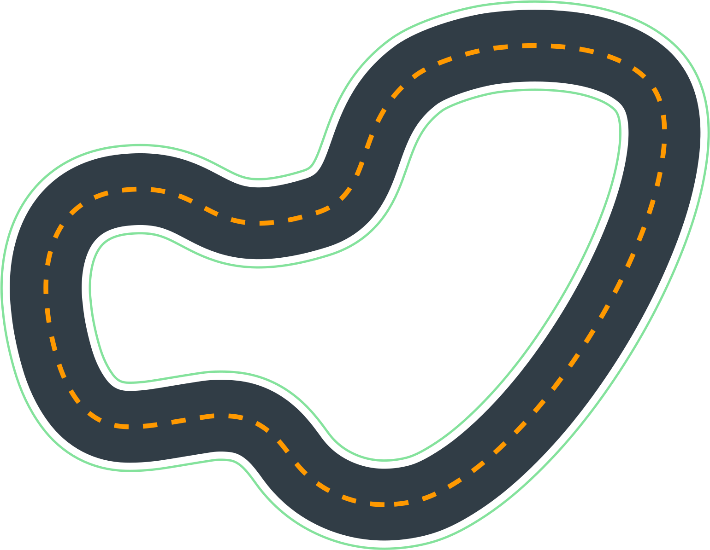

# Training Tracks

# re:Invent 2018

Dimensions | Meters | Inches
-----------|--------|-------
Length: | x1 | x2
Width: | y1 | y2

# AWS Summit Raceway

Dimensions | Meters | Inches
-----------|--------|-------
Length: | x1 | x2
Width: | y1 | y2

# The 2019 DeppRacer Championship Cup

Dimensions | Meters | Inches
-----------|--------|-------
Length: | x1 | x2
Width: | y1 | y2

# Toronto Turnpike Training

Dimensions | Meters | Inches
-----------|--------|-------
Length: | x1 | x2
Width: | y1 | y2

# Cumulo Carrera Training

Dimensions | Meters | Inches
-----------|--------|-------
Length: | x1 | x2
Width: | y1 | y2

# Shanghai Sudu Training

Dimensions | Meters | Inches
-----------|--------|-------
Length: | x1 | x2
Width: | y1 | y2

# Empire City Training

Dimensions | Meters | Inches
-----------|--------|-------
Length: | x1 | x2
Width: | y1 | y2

# Kumo Torakku Training

Dimensions | Meters | Inches
-----------|--------|-------
Length: | x1 | x2
Width: | y1 | y2

# London Loop Training

Dimensions | Meters | Inches
-----------|--------|-------
Length: | x1 | x2
Width: | y1 | y2

# Bowtie Track

Dimensions | Meters | Inches
-----------|--------|-------
Length: | x1 | x2
Width: | y1 | y2

# Oval Track

Dimensions | Meters | Inches
-----------|--------|-------
Length: | x1 | x2
Width: | y1 | y2

# re:Invent 2018 Wide

Dimensions | Meters | Inches
-----------|--------|-------
Length: | x1 | x2
Width: | y1 | y2

